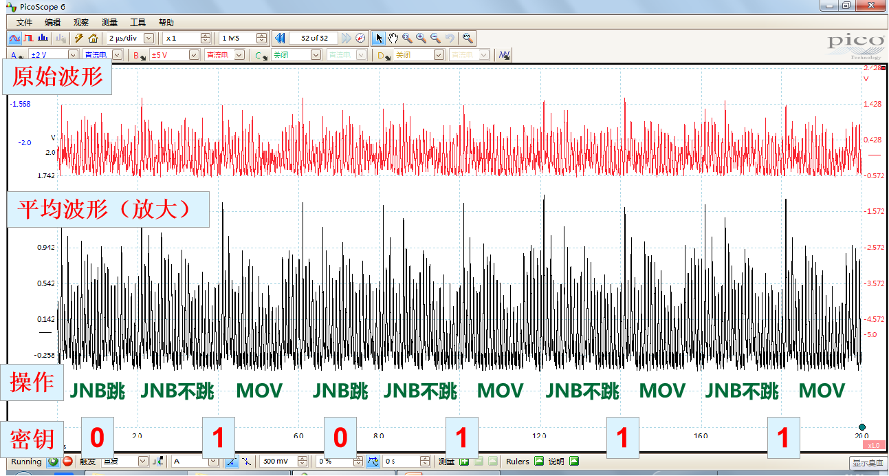
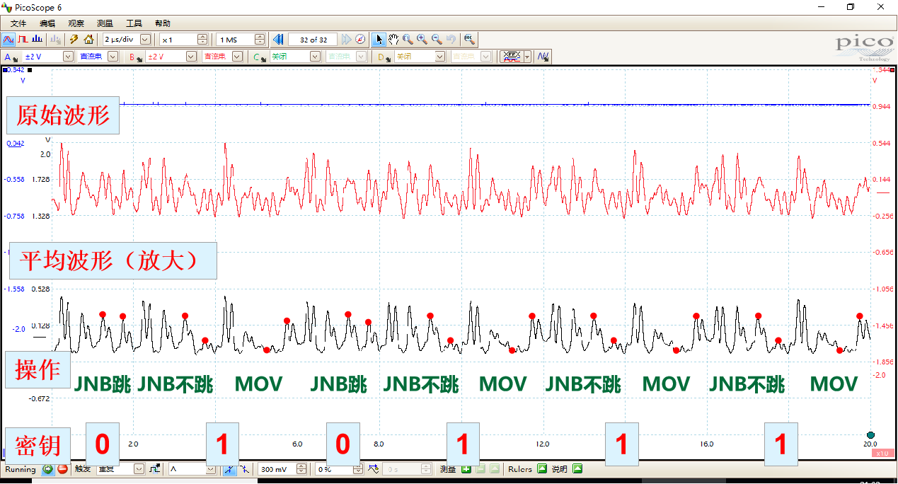

第二部分：密码实现的物理安全
# 8. 密码算法硬件实现
密码算法硬件实现的应用场景
1.同一颗芯片内加速密码运算
2.通过设备内其它模块加速密码运算
3.调用其它设备实现密码加速
4.提升物理安全等级
（存密钥+抗侧信道攻击）
5.密码算法暴力破解加速

数字逻辑电路的高级编程语言
Verilog HDL和VHDL是目前世界上最流行的硬件描述语言，开发于20世纪80年代，均为IEEE标准。

Verilog HDL
扩展名为.v
编程风格灵活
代码简洁
多用于小规模开发项目
语法与C语言相似
VHDL
扩展名为.vhd
语法严谨
代码偏长
多用于大规模协作型开发项目

功能仿真
假设门电路完全不存在延时，纯功能验证，不考虑实现工艺与平台

信号在电路中传输是有延时的，如线延时、器件延时等，时序仿真需考虑延时
不同平台延时不同，故在EDA（Electronic Design Automation）工具里做时序仿真之前需要明确具体实现的平台，例如Xilinx公司Spartan-6系列XC6SLX75型号的FPGA芯片

信号在电路中传输是有延时的，如线延时、器件延时等，时序仿真需考虑延时
不同平台延时不同，故在EDA（Electronic Design Automation）工具里做时序仿真之前需要明确具体实现的平台，例如Xilinx公司Spartan-6系列XC6SLX75型号的FPGA芯片

### 组合逻辑电路设计

Verilog使用模块（module）的概念来代表一个基本的功能块
一个模块可以是一个元件，也可以是低层次模块的组合
模块通过输入输出接口被高层模块调用，隐藏内部实现细节。这样设计者可以方便地修改某个模块，而不影响其他部分

自顶向下设计：
先定义顶层功能块，进而分析需要哪些构成顶层模块的必要的子模块，然后进一步对各个子模块进行分解，直至达到无法进一步分解的底层功能块
示例：CPU设计时先考虑分为运算器、控制器、寄存器、时钟等模块
自底向上设计：
先对现有功能块进行分析，然后使用这些模块来搭建规模大一些的功能块，如此继续直至顶层模块
示例：初学者具体实现某个电路时一般按自底向上设计

用组合电路实现AES算法的第一轮

可以看到分为SB 选择器
SR 位移寄存器
MC 列混淆
AK 密钥加

### 时钟
时序电路由时钟来统一控制节奏
时钟信号：
用于决定逻辑单元中的状态何时更新，是有固定周期并与运行无关的信号量
寄存器：
通常由时钟上升沿触发存储行为
在存储的同时，会带来后续组合电路的跳变
关键路径：
组合电路模块从输入到输出经过的延时最长的逻辑路径
时钟周期一定要大于关键路径延时(关键路径就是数据结构里面的最长路径)

比如一个简单的计数器
```verilog
always @(posedge clk)
    if(start==0)
        count <= 0;
    else if(count==10)
        count <= 0;
    else
        count <= count + 1;
```
根据这个，AES有两种设计方式:

第一种，把寄存器放到输出

第二种，把寄存器放


## 效率评估指标
### 面积：密码模块总共占用多少逻辑单元（FPGA场景）、逻辑门（ASIC场景）
### 功耗：密码模块单位时间内消耗的能量
### 速度（吞吐量）：密码模块单位时间内能够加密的比特数

### 吞面比：吞吐量与面积的比值
用于公平衡量密码硬件实现方案的效率
### 主频：密码模块能够正常运行的最高时钟频率
若时钟周期小于密码电路的关键路径，则程序会出现错误

# 9. 密码芯片侵入式分析
30年前的嵌入式系统，是由CPU、ROM、RAM、I/O缓冲器、串口等分离的部件组成
攻击者的目标：读取或修改CPU的程序
早期的MCU（Micro-controller，微控制器）没有提供非易失性存储能力，重要数据不得不存在MCU外部单独的芯片上，因此很容易被读出数据
早期攻防方式:将EEPROM和MCU放在同一封装内部
  EEPROM 是指带点可擦可编程只读存储器
衍生的攻击方法:
  1.打开样品的封装，用微探针获得数据
  2.拆下片内的EEPROM，用专用设备读取数据
用安全熔丝来增强安全性

可以通过安全熔丝来禁止外部用户访问片内数据，如控制编程接口进行回读
将安全熔丝做成储存阵列的一部分，显著增加定位和复位的难度

存储器访问实施身份认证
采用口令来对控制对存储器的访问
易受攻击:计时分析，能量分析
计时分析:通过测量芯片的响应时间来推断芯片内部的运行状态
能量分析:通过测量芯片的功耗来推断芯片内部的运行状态
利用电源毛刺绕过校验机制
电源毛刺是指电源电压在短时间内突然变化的现象
电源毛刺会导致芯片内部的电路出现异常行为，从而绕过校验机制
```verilog
Line 1:InputPassword()
If Password_verify()==false 在这里插入电源毛刺
    Line 2:AccessData()
```

顶层金属网格防止探针攻击
顶层金属网格:
所有网格都能监控开路和短路，一旦触发就会导致特定储存器复位或清零
缺点:异常情况也会触发
有时候会使用伪顶层金属网格
缺点:容易遭受光学分析

### 用总线编码技术防止微探测攻击
一些智能卡存储器采用总线编码（Bus Encryption）技术来防止微探测攻击
即使攻击者获得数据总线上传输的数据，也无法知道正在传输的密钥或敏感信息
主要用于抵抗侵入式、半侵入式攻击

### 使用混合逻辑保护总线位置
混合逻辑：将标准的模块化结构（如解码器、寄存器、ALU、IO电路等）用同一套完整的ASIC逻辑实现，使攻击者难以找到总线的位置
该技术广泛应用于防盗版，并能够提升CPU的安全性和性能
部分混合逻辑：芯片由不同模块组成、每个模块分别使用混合逻辑设计

### 平坦化工艺
90年代，使用激光切割器、简单的探针台即可读写芯片表面的任意位置
PIC16F877微控制器的电路在显微镜下容易观察，并进行逆向工程，藏在顶层金属下的第二层金属和多晶硅层仍然可见
PIC16F877A微控制器中使用了平坦化（Chemical-Mechanical Planarisation）工艺，显微镜下不会显示出更深的层

### 安全系统的保护等级
1991年，IBM定义了安全系统对不同攻击方法所具有的保护等级
零级：系统中没有使用特别的安全措施，所有部分可以自由访问
例如：使用外部ROM的MCU和FPGA
低级:有一些安全措施，但是可以通过简单的方法绕过，比如电烙铁或者廉价示波器就可以，不需要很久
例如：有未受保护内存的MCU，但是程序未公开
中低级
安全措施可以抵挡大多数廉价攻击手段，需要使用相对昂贵的攻击和特定的知识
例如：不能抵抗能量分析，电源毛刺攻击的MCU
中级:需要使用特殊的设备，并且需要特殊的知识
放紫外线攻击的MCU，旧的智能卡
中高级:需要使用特殊的设备，并且需要特殊的知识
高等级保护的现代智能卡，复杂ASIC，安全性FPGA和CPLD
高级:可抵抗已知所有攻击，需要团队研究攻击方法
例如：用于专业认证的密码模块

攻击的分类
破解目标:恢复安全算法
微探测技术
直接访问芯片表面，用来观测，修改，干扰集成电路的工作
逆向工程
推导半导体芯片的内部结构并学习或模拟他的功能
软件攻击
用在处理正常的通信接口上，从协议，密码算法及其实现来获得安全保护的弱点
窃听技术
通过电磁辐射，电磁干扰，电磁波等方式窃取信息
故障注入技术
使处理器发生错误操作来获得额外的读写能力
克隆:竞争对手会复现现有产品降低研发

## 芯片攻和防的对抗
## 安全等级与攻击分类
## 密码芯片的侵入式分析
## 密码芯片的半侵入式分析
## 密码芯片的非侵入式分析
攻击“通过隐匿实现安全”
厂商故意抹掉MCU芯片型号、或贴上客户的logo，使攻击者不知道这是什么型号的芯片；攻击者通过观察各类接口引脚来猜测MCU型号，随后尝试用通用下载器来访问芯片
厂商未公开MCU代码的烧写协议；攻击者可通过特殊渠道获得开发板，做各种实验来搞清楚烧写协议
穷举攻击
暴力破解微控制器中的访问口令
遍历式尝试芯片的各种输入，观察其输出，猜测片内执行的功能
FPGA芯片通过JTAG口进行外部指令遍历
Flash芯片通过管脚进行指令遍历（时钟、数据总线、复位等控制信号很容易辨认）
部分芯片留有Debug接口，攻击者通过升高芯片引脚的电压、尝试外部通信协议来试图进入Debug模式
侧信道分析
计时分析:通过测量芯片的响应时间来推断芯片内部的运行状态
能量分析:通过测量芯片的功耗来推断芯片内部的运行状态
电磁分析:通过测量芯片的电磁辐射来推断芯片内部的运行状态
毛刺攻击
时钟毛刺攻击:通过改变芯片的时钟频率来干扰芯片的正常工作，进一步说，产生一个时钟信号的毛刺，使芯片在不同的时钟频率下运行
电源毛刺攻击:通过改变芯片的电源电压来干扰芯片的正常工作

数据保持攻击
低温下SRAM的数据保持攻击：零下20度以下，SRAM断电后，数据能够保持几秒钟到几分钟
非易失性存储器的数据保持攻击：存储器的数据即使在擦除100次后，电子也没有完全从浮栅中离开，这使得攻击者有可能获取存储器中的内容
RowHammer攻击：攻击者通过多次访问一个内存地址，造成内存控制电路的电压波动，篡改其隔壁内存地址中存储的内容


# 10. 密码侧信道分析与防护

## 侧信道分析概述
经典密码学的基本理论假设：局部物理安全性
实际情况：密码设备在运行过程中与外界环境存在物理交互，这种物理泄露可能泄露密钥信息

计时分析:测量某个运算消耗的时间，不同时间会对应不同操作/操作数
缺点：现实中采集到的总时间很不准确，无法精确到密码运算过程中每个操作的时间
解决思路：采集能量波形，从能量波形中精确提取每一环节的时间信息
能量分析:密码芯片供电电源上串联一个小电阻，用示波器测量电阻两端电压差的瞬时值，该电压与芯片功耗直接相关
缺点：有些设备的主板太精密，芯片电源上不容易加小电阻
电磁分析:
密码芯片在运行过程中的功耗波动引起电磁辐射，该信息可被电磁线圈捕捉到
优点：不再需要修改芯片外围电路；缺点：易受到各种电磁波的干扰
声音分析:
从声音中提取计算机中正在运行的RSA密码算法的侧信息
研究发现，该声音来源于计算机CPU功耗波动引起的电容充放电
采用抛物面麦克风，研究人员在4米之外成功提取到了有效声音信息
采用手机麦克风提取该信息的有效距离为30厘米
故障分析
电源毛刺故障注入
时钟毛刺故障注入
电磁故障注入
激光故障注入
## 简单能量分析
缓存就是数据交换的缓冲区，当某一硬件要读取数据时：
首先从缓存中查找需要的数据，如果找到了则直接执行（速度快）
找不到的话则从内存中找（速度慢）

目标：实现B = PC-1(A)

步骤1：把B清零
步骤2：按A的比特编号进行56次循环：
若A[i] = 0，则什么都不做（跳转）
若A[i] = 1，则查表得知这个1在B中的去向，并写入B相应的位置（不跳、执行下一条写操作）

simple energy 简单能量分析

原始波形看起来，可以看到MOV在后一半周期明显比其他的信号要小，有次可以找到所有MOV的位置
简单能量分析(滤波)

滤波后的波形，JNB跳的时候有三个峰，不跳的时候有两个峰，MOV在中间没有峰，由此可以得到所有的

RSA算法的简单能量分析
先低后高S M 是1，只有一个低是0，根据这个可以得出

ECC算法的分析:
Q的时候后半段毛刺很均匀，但是P的毛刺不均匀
## 相关能量分析与模板攻击
情况1：不同密钥，对应的操作不同
例：if – then – else 语句


情况2：不同密钥，对应的操作数不同
例：赋值语句 A = B

汉明重量模型
T = a HW(x) + b
T（Power Trace）与HW(x)必然存在一种关系

相关系数定义:
实际中，如何判断一次能量分析实验是否成功？（即恢复的密钥是否正确）

用户可以找到一台具有写密钥权限的、与被攻击设备几乎一模一样的设备

汉明重量模型（适用于软件）
T = a HW(x) + b
汉明距离模型（适用于硬件寄存器跳变）
T = a HD(x, y) + b
T = a HW(x⊕y) + b
零值模型（多见于特定组合电路）
输入值为0：特殊波形
输入值非0：一般波形
ID模型（多见于一般组合电路）
输入值不同时，波形均不同

## 侧信道防护对策
芯片级
用传感器覆盖关键电路
抗探测，FIB，激光，高频电磁波，高压毛刺，时钟毛刺
在芯片的电源引入噪声
用电容缓冲电压变化
随机时钟

系统级
伪算法(伪随机)
多个算法同时进行
随机延时

算法级
掩码
伪轮
S盒乱序
多级流水线并行

门级
双轨逻辑电路
预充电模型
双轨预充电逻辑

## 针对侧信道防护对策的高级分析
随机延时:弹性对其
海量波形统计
双规逻辑:电磁攻击
对不齐:差分频域攻击
攻击掩码——碰撞相关攻击

# 11. 密码芯片故障分析
