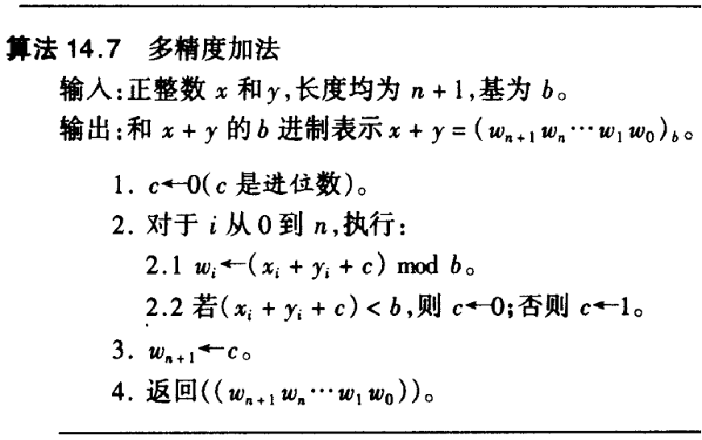
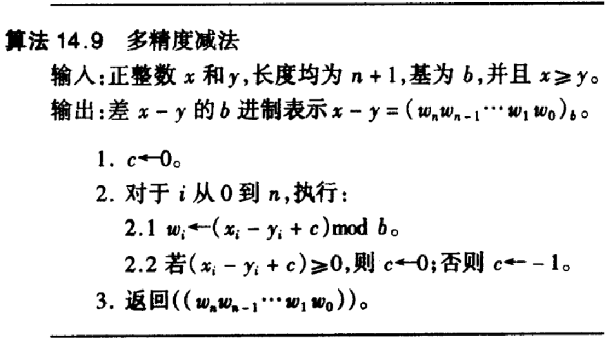
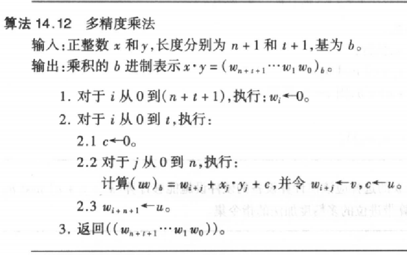

# 分组密码软件实现

## 1.什么是加密
古典:规则保密则信息安全
现代:密钥保密则信息安全

## 密码算法实现思路
1.了解需求
2.设计数据框架和结构
3.编码和测试

## 测试内容
1.正确性
测试向量：算法文档提供的
2.吞吐率
单位时间加密次数
单位时间加密数据量
3.资源占用
动态分配空间回收
硬件编程布线面积

分组密码:
Definition：In a block cipher, a group of plaintext symbols of size m (m>1) are encrypted together creating a group of ciphertext of the same size. Based on the definition, in a block cipher, a single key is used to encrypt the whole block even if the key is made of multiple values.

翻译:
在块密码中，一组大小为m（m>1）的明文符号一起加密，创建相同大小的密文组。根据定义，在块密码中，即使密钥由多个值组成，也使用单个密钥加密整个块。

为什么分组？
因为分组可以提高安全性，提高效率，提高安全性。
为什么明密文等长？
因为分组密码是替换密码，替换密码是一对一的，所以明密文等长。
为什么采用迭代方式实现，且每轮有密钥参与？
因为迭代可以提高安全性，密钥参与可以提高安全性。
还记不记得AES算法，为什么有不同版本？
因为AES算法的密钥长度不同，所以有不同版本。

## AES算法数据结构
state 
s00-s33共16个

plantext

储存形式:state[4][4]或者state[16]


流程图:
AES加密开始

输入明文，密钥，关键参数

AddRoundKey

轮数计数置零

开始第一轮

每一轮的流程

S盒置换 SubBytes
主要就是将state中的每一个字节替换成S盒中的对应字节

行移位 ShiftRows
是将state中的每一行进行循环移位操作，第一行不变，第二行循环左移一位，第三行循环左移两位，第四行循环左移三位,因为我们是4*4的格子，所以只有四行

列混合 MixColumns
就是将state中的每一列进行矩阵运算，矩阵乘法

密钥加(白话密钥，轮密钥) AddRoundKey
就是将state中的每一个字节与轮密钥中的对应字节进行异或操作

对外接口 byte[] plantext,byte[] key,byte[] iv
{
    //初始化
    //密钥扩展
    //轮密钥生成
    //加密
    //解密
}

这里涉及到一个乘法 {03}.S_{1,c}
03 = 0000 0011
S_{1,c} = a_7x^7 + a_6x^6 + a_5x^5 + a_4x^4 + a_3x^3 + a_2x^2 + a_1x + a_0
所以
{03}.s_{1，c}=(x+1)(a_7x^7 + a_6x^6 + a_5x^5 + a_4x^4 + a_3x^3 + a_2x^2 + a_1x + a_0)

密钥加(白话密钥，轮密钥) AddRoundKey
白话密钥就是我们输入的密钥，轮密钥就是我们生成的轮密钥

解密的话就是所有的操作反过来

首先是AddRoundKey，然后是MixColumns，然后是ShiftRows，最后是SubBytes

InvMixColumns(inValue SubKey)=InvMixColumns(MixColumns(inValue,SubKey),SubKey)

## 分组密码工作模式
### ECB
Electronic Codebook
1.Padding 填充为分组密码整数倍
2.初始化向量 同一个密钥加密前提下不使用相同IV


解密就是加密的逆过程

### CBC
Cipher Block Chaining
上一次的密文作为下一次的和下一次的明文异或，注意我们有一个initialization vector
解密的时候
上一次的密文和这一次的明文进行异或
初始化向量:同意密钥加密前提下不使用相同IV
可以证明CBC两边使用相同的initialization vector可以得到相同的明文
### CTR
Counter
我们的做法是对Nonce和计数器进行加密，然后和明文异或，将Nonce和计数器拼接成一个128位的数，然后加密，然后和明文异或
解密的时候和加密的时候一样，

问题:
是否还需要padding？ 不需要，因为最后我们的padding是截取的
相同密钥前提下使用相同IV会造成什么后果？
会造成相同的密文

# RSA算法

## RSA算法软件实现任务分解
RSA可以分解为参数选取和模幂运算两个部分
参数选取有模逆运算和素数判定两个部分
模幂运算是模乘积算

四个问题:
### 1.如何在32位或64位PC上保存1024比特明文，密钥，密文(实际上NIST建议2048比特)
#### 按照比特存
很方便但是效率太低
#### 按照字符串存
输入输出方便，但是效率太低
#### 按照字节存
输入输出方便，效率也高
#### 按照CPU位存
1024比特大数以CPU位宽为单位进行存储，可以定义数组为A[0]~A[31]

大数的存储:数组
我们希望在32位CPU上将大数表示为2^32进制
因为32位CPU通常一次可以处理1-2个规模为2^32大小的数据

单精度的整数实例:
1.字(word)unsigned int A
2.字节(byte)unsigned char A[4]

多精度加法
英文:Multiple Precision Addition

注意一点:进位，一开始c被初始化为0，然后每次加法都要加上c，然后c是进位

多精度减法
英文:Multiple Precision Subtraction

一样子的，借位

多精度乘法
英文:Multiple Precision Multiplication


然后是优化:Karatsuba算法
计算
x = x1*2^512+x0
y = y1*2^512+y0
x*y = x1*y1*2^1024+(x1*y0+x0*y1)*2^512+x0*y0
我们可以将x1*y0+x0*y1=(x1+x0)*(y1+y0)-x1*y1-x0*y0
这样我们就可以减少一次乘法
这样子本来是4次乘法，现在是3次乘法，运算效率提高了1/4
2.1024比特的大数如何存储和基本运算

3.1024比特的数如何执行快速幂运算

4.1024比特的数如何执行模乘运算
## 大数的存储和基本运算

## 模幂运算实现
平方-乘法实现模幂运算
输入	𝒙，𝑵，1024比特𝒅=(𝒅𝟏𝟎𝟐𝟑||…||𝒅𝟏||𝒅𝟎)𝟐
输出	𝒙𝒅 𝐦𝐨𝐝 𝑵
1	𝑨=𝟏 
2	For 𝒋=𝟏𝟎𝟐𝟑 to 𝟎
 	1	𝑨=𝑨𝟐 𝐦𝐨𝐝 𝑵
 	2	If 𝒅𝒋=𝟏 Then 𝑨=𝑨·𝒙 𝐦𝐨𝐝 𝑵
3	Return 𝑨
注意这个算法是从右到左的实现
可以使用从左到右，也可以从右到左。从右到左支持模幂运算，
## 模乘运算实现
多精度乘法（Comba算法）
平方-乘算法是一种用于计算大整数幂运算的有效方法，尤其是在密码学中使用。该算法有两种主要的实现方式：从左到右和从右到左。这两种方法在计算 \( a^b \mod c \) 时有不同的行为，特别是在并行计算的支持方面。

### 从左到右算法

在从左到右的算法中，我们从最高位开始处理指数 \( b \) 的每一位。对于指数的每一个位：

1. **平方**：先将当前结果平方。
2. **乘法**：如果该位是1，则再乘以基数 \( a \)。

每一步的结果都依赖于前一步的结果。这种序列依赖意味着当前步骤必须等待前一步骤完成才能开始，因为每一步的输入都是前一步的输出。这种强依赖关系使得并行化变得困难，因为无法同时执行多个步骤。

### 从右到左算法

从右到左的算法则从指数 \( b \) 的最低位开始处理。算法步骤如下：

1. **初始化**：设置一个累积结果 \( result \) 为1，设置 \( current\_base \) 为 \( a \)。
2. **检查指数**：对于指数 \( b \) 的每一位，如果是1，则将 \( result \) 乘以 \( current\_base \)。
3. **平方**：无论当前位是什么，都将 \( current\_base \) 平方。

在这种方法中，计算每一步的 \( current\_base \) 可以相对独立地进行，因为每次平方操作并不依赖于 \( result \) 的当前值，只依赖于 \( a \) 的逐步平方。这意味着平方操作可以预先计算或并行计算，而 \( result \) 的更新（乘法操作）仍需按顺序执行。因此，从右到左的方法提供了更多并行操作的机会，尤其是在平方计算阶段。

### 并行实现的关键点

- **从左到右**：每一步的操作都直接依赖于前一步的结果，导致无法并行执行。
- **从右到左**：平方操作可以预计算，因为它们不依赖于乘法结果的累积，只依赖于基数的连续平方。

总的来说，从右到左的平方-乘算法因其操作的相对独立性而更适合并行实现。

## 公钥密码算法实现

用内联汇编提升乘法软件实现的速度

以下是代码
```c
mov eax,12345h

mov ebx,6789ABCDh

mul ebx

mov ecx,eax

mov edx,edx
```

## CRT加速RSA算法

使用CRT加速RSA算法基本上使速度提高了四倍

# 操作系统的内存管理

## 内核态
无限制访问底层硬件
高级指令只能在该状态执行
控制硬件资源上层应用程序提供运行环境
一旦内核运行崩溃，整个操作系统都受影响(kernel panic)

## 用户态

用户态不能直接获取资源，只能使用api来访问
运行崩溃，不会影响
调用三种方式:系统调用，异常事件，外围设备中断

执行任意指令、访问处理器寄存器、访问任意设备、读写任意内存地址
1）系统调用。系统调用是操作系统提供给用户程序的接口，应用程序可以主动调用系统调用来切换到内核态。系统调用完成指定的功能，并将执行结果返回给调用者，这样可以防止用户态应用程序随意访问硬件资源。
2）异常事件。当处理器正在执行运行在用户态的程序时，若突然发生某些预先不可知的异常事件，就会触发从当前用户态的进程转问内核态执行相关的异常处理事件，典型的如缺页异常。
3）外围设备中断。当外围设备完成用户的请求操作后，会向处理器发出中断信号，时处理器就会暂停执行下一条即将执行的指令，转去执行中断信号对应的处理程序。如果先前执行的指令来自用户态，则自然就发生从用户态到内核态的转换

### 用户态进程隔离
目的：保护操作系统中的进程互不干扰，防止其他进程非法读取和写入本进程资源，使得密码软件的密钥不被同一设备上运行的其他进程非法获取


## 用户态密码软件实现
1.库(动态，静态)
驻留调用者进程空间，所有密钥和密码计算过程完全暴露给调用者进程
更容易整合到应用中，在实际应用中仍是主流

2.独立进程
与调用者进程相隔离，调用者需要通过进程间通信等方式对其进行调用
安全性更高

常见用户态密码库
1.Openssl
底层是libcrypto,组成SSL协议库，提供SSL,TLS，DTLS，进行实现。支撑命令行

密钥保护
1.安全堆
动态申请内存，首尾各维护一个空白守卫页 ，一旦出现悬垂指针越界则强行终止
锁定在物理内存中，禁止交换到硬盘或输出到核心转储，避免敏感数据扩散
提供了专门的内存申请、释放、清除等接口，自动执行额外的安全清除和释放函数

2.密钥保护措施
密钥生成：采集多种可用随机源，如系统随机数接口、时间戳、CPU随机数指令和熵源生成设备等
密钥导入和导出：支持PKCS#8格式编码的私钥导入和导出，私钥通过口令派生的对称密钥进行加密
密钥使用：安全堆为敏感参数分配内存
密钥销毁：将memset函数赋给一个volatile函数指针调用，保证memset执行，销毁内存中的密钥数据

2.Crypto++

密码算法和协议实现非常齐全：先于 OpenSSL实现了对AES和ECC算法的支持
支特一些不大流行、不太常用的密码方案，Camellia、Whirlpool等
提供一些草案算法和冷门算法的实现以供研究

密钥生成：调用系统接口来生成密钥所需的随机数种子，鉴于真随机数接口可能因缺少熵源而阻塞，也允许使用系统伪随机数接口
密钥导入和导出：提供PEM格式的密钥存储和导入/导出功能，不提供加密导入/导出私钥的接口（用户可调用库中密码原语或导入第三方包弥补这个功能）
密钥使用：自定义安全内存块结构作为包括密钥、初始向量等敏感参数的存储空间，并且能够在其使用结束后进行可靠清除
密钥销毁：使用内联汇编写了一条不会被编译器优化掉的内存写入语句，制造内存屏障，强行对指定内存区域进行覆盖写

PEM（Privacy Enhanced Mail）
密钥生成 Crypto++调用系统接口来生成密钥所需的随机数种子鉴于真随机数接口可能因缺少熵源而阻塞，Crypto+＋ 也允许使用系统伪随机数接口
密钥导入和导出Crypto++ 提供PEM 格式的密钥存储和导入/ 导出功能，但没有像OpenssL 那样直接提供加密导入/ 导出私钥的接口。但是，用户可以调用库中的密码原语自行实现使用口令加密的私钥导入/导出，也可以在编译库时导入第三方包来弥补这一功能。
密钥使用 Crypto++实现了自定义的安全内存块结构(SecBlock、SecByte Block、SecWordBlock)，可以作为包括密钥、初始向量等敏感参数的存储空间，并且能够在其使用结束后进行可靠清除
密钥销毁Cryptot＋ 使用内联汇编和memory 参数编写了一条不会被编译器优化掉的内存写人语句，制造内存屏障(memory barrier)，强行对指定内存区域进行覆盖写公达到密钥销毀的目的。汇编指令中的 memory 关键字表示除了输人/输出参数之外，该指令还可能会读写某些未知的内存数据，所以编译器不会轻易将其优化、确保内存中的密钥数据销毀


3.Cryptlib

允许开发者将密码服务和身份验证服务合并到软件中
使用多种行业标准数据格式，很容易地将加密或签名的数据传输到其他系统并进行处理
可以使用各种外部密码设备提供的密码功能，提供通用插件功能用于添加新功能

密钥生成：收集了大量信息作为熵源，如CPU时钟、进程资源占用情况、系统启动时间、硬件和驱动的架构及版本型号、时间戳产生密钥所需的随机比特
密钥导入和导出：公/私钥对在创建完成后就已经分别写入了两个外部文件中，并且私钥经过了口令加密
密钥使用：敏感数据集中管理且内存页锁死，禁止交换到硬盘中；即使调用者忘记进行内存清零操作，软件也会在使用结束时自动擦除并释放安全内存
密钥销毁：优先使用操作系统和C语言标准提供的内存清理接口，如果不可用则改用memset函数(可能会被编译器优化)

4.Nettle
5.Libgcrypt

密钥生成：通过调用系统真随机数服务或伪随机数服务（真随机数接口堵塞时调用）完成熵源积累，进而产生密钥所需的随机比特
密钥导入和导出：作为GnuPG 的一个模块，不关注密钥的存储和导入导出，这些工作由GnuPG下其他模块或工具帮助完成
密钥使用：内部并没有特别注重密钥的运行安全，在私钥操作中，需要把密钥从字符串形式的密钥参数解析到大整数结构中。虽然操作结束时自动擦除了使用完毕的密钥，但外部传入的字符串密钥参数需要由调用者自行擦除
密钥销毁：优先使用explicit_memset方法，如果该方法不可用，则转而使用volatile数据指针来擦除内存数据


## 内核态密码软件实现
Windows CNG（Cryptographic Application Interface：Next Generation）
定义了一个抽象层，底层通过一系列运行在用户态和内核态的库文件(动态链接库或者驱动链接库)提供密码服务的具体实现
应用程序使用密码服务的过桯中，Windows密码服务框架起着中间件的作用，将开发人员与密码服务代码实现分隔开
基本框架
将密码计算和密钥存储进行了分离，分别称为密码原语 (cryptographic primitive)和密钥存储(key storage)

CNG定义一个抽象层，底层通过一系列运行在用户态和内核态的库文件(动态链接库或者驱动链接库)提供密码服务的具体实现
应用程序使用密码服务的过程中，Windows密码服务框架起着中间件的作用，将开发人员与密码服务代码实现分隔开

基本框架是将密码计算和密钥存储进行了分离，分别称为密码原语(cryptographic primitive)和密钥存储(key storage)

密码原语 (cryptographic primitive)
密码原语是密码服务的核心，提供了一系列密码算法的实现，包括对称加密、非对称加密、哈希、消息认证码、数字签名等

密钥存储(key storage)
密钥存储是密码服务的辅助功能，提供了密钥的存储、导入、导出、销毁等功能，以及密钥的保护和管理

# 第6章 密码软件实现面临的攻击

## 软件攻击

### 攻击成因
1.针对操作系统隔离机制漏洞的攻击:操作系统复杂性高，难以避免安全漏洞，致使攻击者绕过操作系统的隔离机制，直接访问其他进程的内存数据

2.针对内存数据残余的攻击
操作系统不会自动清理内存，编译器优化，快照，虚拟内存"页"交换到硬盘，核心转储

3.针对密码软件实现自身漏洞的攻击
程序设计出现逻辑错误，假定的安全条件得不到满足，相同版本在不同系统环境中运行

## 物理攻击
### 冷启动攻击
 DRAM芯片延迟消失效应
内存芯片断电之后，存储的数据不会立即消失，而是持续一段时间后逐渐衰减
在低温环境下，内存芯片中的数据衰减速度会大幅下降，可持续达数小时
采用内存读取工具，可以在习题启动时候接管整个内存，将内存条目从主机拔出，用液氮降温，然后将内存条目插入读取工具，读取内存中的数据

### DMA攻击
目的：减轻CPU负担，提高外设访存速度
做法：经CPU允许，外设可直接访问物理内存空间
问题：恶意外设直接对内存发起访存请求，获取密钥数据

TRESOR-HUNT: 2012年，美国西北大学团队利用DMA，向指定内核内存地址写入特权级恶意代码，读取目标主机内存和寄存器上敏感数据，再通过正常的DMA方式传输获取的磁盘加密密钥
远程攻击：2010年，法国国家网络安全局团队介绍了一种攻击者远程控制网络控制器的方法，他们针对特定型号的网络控制器发送一些精心构造的数据包，对受害者的网络连接执行攻击：利用网卡的DMA特性，访问存储在内存中的密钥和敏感信息。


## 间接攻击

### 算法相关的侧信道攻击

#### 计时侧信道攻击
基于密码算法和密码协议对不同输入（明文和密钥）需要的处理时间存在细微差异分析窃取密钥信息，如：针对RSA的计时攻击
#### Cache侧信道攻击
观察Cache的访问模式(即是否命中 Cache)来推测密钥，如：AES查表

#### 基于页共享的Flush+Reload攻击
1.页共享 将目标进程的可执行文件使用mmap映射到其虚拟地址空间，完成文件的内存页共享

2.flush 将目标进程的内存页从Cache中清除，使得Cache中不再存储目标进程的内存页

3.reload 通过访问目标进程的内存页，将其重新加载到Cache中，观察访问时间，以此推测目标进程的内存页是否在Cache中

4.攻击者通过Flush+Reload攻击，可以推测目标进程的内存页是否在Cache中，从而推测目标进程的内存访问模式，进而推测目标进程的密钥信息

#### CPU硬件漏洞攻击
预测执行——导致Specture
原因：软件含有条件分支和指令间的数据依赖，会导致CPU流水线阻塞
方案：
预测分支结果、数据依赖关系以及控制流依赖等
验证预测是正确的之前，缓存结果到重排序缓冲区
如果预测正确，提交预测结果，否则清空或回滚重算
乱序执行——导致Meltdown
目的：每一条指令会进一步转化为多个微操作，CPU 尽可能地充分利用执行单元快速并行地处理微操作，以达到提升总体性能的目的
方案：
一旦获得运算数并且执行单元空闲，即使之前的指令流还没执行完，也会开始执行这个微操作
利用重排序缓冲区跟踪微操作状态，所有之前的微操作全部完成时，结果才能在架构层面可见
当发生异常情况或者外部终端请求时，CPU会清空重排序缓冲区中所有未提交的结果

# 第7章 基于寄存器、Cache、可信执行环境的密钥安全方案

计算机存储单元结构
简单的分为四层
1.寄存器
2.高速缓存
3.内存
4.硬盘

越往上，储存空间更小，读取速度更快，单字节成本更高

CPU寄存器保存从cache提取的字
Cache保存从内存提取的缓存行
内存保存从硬盘提取的磁盘块

## 基于寄存器的密钥安全方案
安全假设
攻击者能力:
可以发起冷启动攻击，获取芯片上全部数据
攻击者权限
在计算机上有普通用户权限，但是没有root权限
系统安全假设
攻击者不能使用操作系统漏洞非授权的访问内核态
初始化
在密钥初始化阶段不存在攻击

技术挑战
密码计算相关变量不能存在于其他堆栈和段里面
必须使用寄存器长期保存密钥但是不影响系统整体性能
高级语言不能显示调用寄存器，必须使用汇编语言实现

密钥存储
寄存器不能被用户态访问

基于寄存器的对称密码算法实现方案
特权寄存器，用户进程不能使用，加解密

内核态加解密，避免运行过程中被中断，进而交换到内存中
加解密前禁用中断和调度，保证计算原子性
由于计算过程处于不可调度、不可中断的状态，使用非特权通用寄存器也是安全的
输出计算结果后，清除轮密钥等敏感中间状态数据，才启用调度和中断

基于寄存器的公钥密码算法实现方案——初始化

公钥密码私钥及大量中间计算结果占用大量空间，不可能将私钥直接存放在特权寄存器中
加密的RSA私钥储存在内存硬盘或其他外部存储介质中
口令派生的AES主密钥安全存储在特权寄存器中

RSA私钥解密
在接收到RSA计算请求时，从外部读取加密的RSA密钥，利用AES安全解密RSA私钥，将明文形态的RSA私钥临时存放在寄存器内

## 基于Cache的密钥安全方案

1.(寄存器方案的)挑战
可扩展性较差。寄存器数量有限，随着安全强度提高，如果要支持更长的密钥，这类安全方案很难扩展
兼容性不好。计算时占用一些通用的寄存器，对CPU处理数据密集型程序和多媒体处理程序有较大影响
平台依赖性大。需要直接操作寄存器，因而无法直接使用高级编程语言，必须使用平台相关的汇编语言

Cache 对于开发者是透明的，不能直接对Cache进行存取操作
Cache 替换和写回机制不易控制，是系统根据使用情况动态分配的
Cache 通常是多层次架构，不可控因素更多，给实现带来不便

基本思想:基本思想：利用Cache替代内存进行计算和存储，即 Cache As RAM（CAR）。
实现思路：在存储期和计算期，将需要保护的所有敏感数据和中间计算结果完全锁定在Cache中，密码计算进程独占CPU，保证数据不被其他进程有意/无意刷新到片外的内存

## 基于可信执行环境的密钥安全方案

可信执行环境 (Trusted Execution Environment, TEE) 是主处理器上的专用区域，它对加载到该环境内部的代码和数据实施额外的安全保护，可与操作系统并行运行

软硬件结合方式实现：硬件隔离保证富操作系统 (rich OS) 上的用户应用程序不能访问那些只有 TEE 内部可信应用才能访问的外设和内存等资源；软件隔离保证了 TEE 内部可信应用之间不能互相进行非授权访问

ARM TrustZone
两个虚拟核心，其中一个为安全环境，实现了与非安全环境之间的硬件和软件资源隔离
Intel SGX
提供可信的用户态空间，以保障用户关键代码和数据的机密性和完整性
Intel TXT
结合特定 CPU、专用硬件和相关固件，构建度量信任根，提供可信平台和操作系统

## ARM TrustZone
一个硬件安全拓展，提供ARM平台系统维度，硬件层次隔离，定义两个执行域-安全域，普通域
CPU状态隔离，支持两种CPU状态，安全状态和非安全状态，通过安全配置寄存器标志来添加监视器模式
内存区域隔离:安全域和普通域的内存区域隔离，通过安全配置寄存器标志来添加监视器模式
外设隔离:安全域和普通域的外设隔离，通过安全配置寄存器标志来添加监视器模式，安全域可以访问所有外设，普通的只能访问普通外设
密钥安全方案

### 代码完整性保护
按照 加载安全启动程序加载安全操作系统镜像和密码软件实现加载非安全启动加载程序和富操作系统内核安全启动加载程序跳转系统到普通域 的顺序启动系统
由于密码软件实现是在富操作系统之前加载的，富操作系统中的攻击者无法破坏启动过程，这样攻击者就无法篡改静态密码软件实现

### 运行期密钥保护
域隔离机制保证了密码计算过程中敏感数据安全
域切换机制保证攻击者无法发起恶意域切换，并在完成计算后清理寄存器和内存
注：不能抵抗冷启动攻击和DMA攻击

## Intel SGX
enclave(飞地)是一套CPU指令，支持应用程序通过初始化创建enclane，禁止堆应用程序，操作系统，虚拟机等对enclave代码和数据直接访问

内存加密：在物理内存划定保留区域，数据由CPU加密后存入内存，加密密钥永不出CPU，每次开机时随机生成，操作系统也无权访问

隔离执行环境：不同enclave拥有唯一标识，与enclave内代码Hash值相关，称为enclave度量值，CPU通过此值在硬件层次上区分enclave；挂起时将当前状态加密存储，清空寄存器

数据密封：内部数据加密认证，密钥专属本enclave，由度量值、签发者公钥杂凑值、自定义信息、CPU内固化秘密信息派生

### 代码完整性保护
每个enclave度量值唯一且与enclave内代码相关，对代码的任意修改都会导致enclave度量值改变，CPU 能够通过度量值在硬件层次上区分enclave。因此，外部无法破坏enclave内的密码软件实现的代码完整性

### 运行期密钥保护
不同 enclave 之间相互隔离，外部无法访问和篡改 enclave 的寄存器；一旦enclave离开CPU，处理器清空运行状态所有敏感数据
SGX 的处理器保留内存机制对内存数据进行了加密，不仅可以防止常规操作系统的攻击者获取其中的敏感信息，还可以抵御物理攻击

### 存储期密钥保护
数据密封功能对密钥等敏感数据进行加密，密封密钥只能由 enclave 自身获取，包括其他enclave、操作系统、虚拟机监控器等在内的外部实体都无法获取该密钥

## Intel TXT

Intel TXT 是 Intel 处理器系列的硬件安全扩展，主要目标是：
验证平台及其操作系统的真实性
确保真实的操作系统在受信环境中启动，然后可以将其视为受信任的环境
向受信任的操作系统提供额外的安全功能

### Intel TXT 是 Intel 处理器系列的硬件安全扩展，主要目标是：
验证平台及其操作系统的真实性
确保真实的操作系统在受信环境中启动，然后可以将其视为受信任的环境
向受信任的操作系统提供额外的安全功能

### 度量(measurement)：
使用密码杂凑算法对一个可执行程序进行消息摘要计算，确保其唯一性且能够探测出对其的修改
TXT 对启动环境中的关键组件进行精确的度量，为每个获得许可的启动组件都设置了一个唯一标识

### 可信平台模块（Trusted Platform Module，TPM）：
提供包括平台配置寄存器（PCR）、非易失性随机存取存储器 、随机数发生器、密码实现、身份鉴别密钥等组件和功能
PCR存储度量值，并不为各个组件存储度量值，而是接照一定的顺序将度量值在 PCR中进行“扩展”

### 信任链：
获取 PCR 的当前值和要扩展的度量值，一起进行密码杂凑计算，然后用该度量值结果替换 PCR 的内容，这样只有以完全相同的顺序进行完全相同的度量工作才能获得一致的度量值，建立信任链

