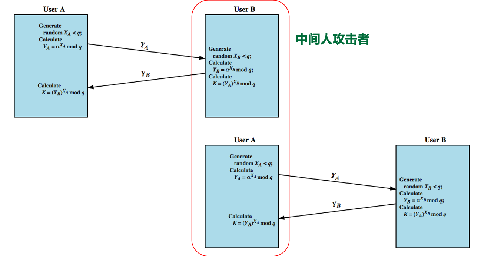
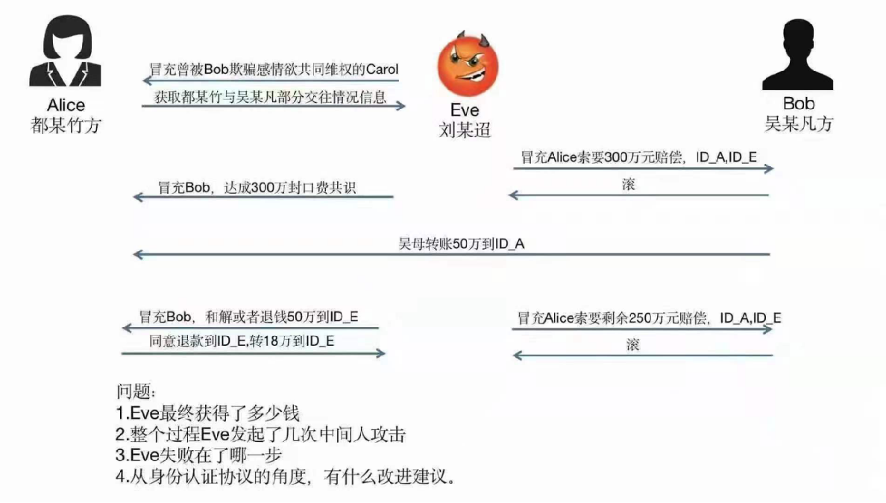

密码学主要有

1.预备知识

2.密码算法PC实现

3.密码算法的物理安全

4.密码产品设计与测评

5.密码应用设计与测评

6.其他专题

案例1:crypto-1算法

2007年，Plötz和Nohl逆向出了M1卡中的Crypto-1算法，发现该算法的有效密钥长度仅有32比特
现今，用高级攻击方法结合Proxmark3等专用设备，应该能够在10秒或更短的时间内克隆任何MIFARE经典卡

小结：
密码算法自己设计，安全性难以保证
逆向分析防不胜防：版图提取、软件反汇编、Flash提取、总线探测、社会工程学……

# 现有国际标准可能存在后门

密码算法的算法型后门Kleptography——1997年由M. Yung提出[1]
2013年，根据斯诺登爆料，美国NSA（National Security Agency）指使RSA公司从2004年起在其加密工具集BSafe中默认使用带后门的双椭圆曲线随机数生成算法
2014年，学术界确认了该后门，利用后门恢复了TLS协议的明文[2]
算法后门检测难度极大，如果没有斯诺登，我们可能仍在使用上述产品——RSA公司的中国客户有中国电信、中国移动、中国联通、中国网通、中国银行、中国农业银行、中国工商行、中国建设银行

[1]	Young A, Yung M. Kleptography: Using cryptography against cryptography. EUROCRYPT 1997, pp. 62−74.
[2]	Checkoway S, Niederhagen R, Everspaugh A, et al. On the practical exploitability of dual EC in TLS implementations. USENIX Security 2014, pp. 319−335.

2013年12月21日，美国国安局(NSA)“棱镜门”监听丑闻又有新进展：据路透社报道，NSA曾与加密技术公司RSA达成了1000万美元的协议，要求在移动终端广泛使用的加密技术中放置后门
两名知情人士称，RSA收受了1000万美元，将NSA提供的方程式设定为BSafe安全软件的优先或默认的随机数生成算法。尽管这一金额看上去不多，但这已经相当于RSA公司有关部门年收入的三分之一
此举将让NSA通过随机数生成算法Bsafe的后门程序轻易破解各种加密数据。RSA否认了相关的内容，并声称自己的加密算法只使用了国家认证的协议，而NSA则拒绝发表评论
简而言之就是，NSA首先利用NIST(美国国家标准研究所)认证了这种有明显漏洞的算法为安全加密标准，然后再让RSA基于这种算法推出安全软件Bsafe。而企业级用户采购安全软件，则看到的是一个世界级企业采用NIST认证的加密标准开发的软件
延伸讨论：
互联网安全专家评论：目前在国内RSA产品的应用非常广泛，大多数互联网公司都在采用这套认证工具。在国外，不少军工、兵器类公司也都是RSA用户。美国国安局在RSA中设置后门意味着，密码动态口令部分已经被美国政府掌握
学术界流传已久的关于DES算法存在后门的“阴谋论”：DES算法非线性组件S-box设计原理至今未公开，如果该组件真的存在快速的线性计算方法，则后门持有者可对DES算法实现高效的攻击

# 案例1.3：举国家（世界）之力设计一个新算法

SM4:国家密码办公室设计的无线局域网加密算法
SM2/SM3 是椭圆曲线公钥密码算法
ZUC 祖冲之算法
SM9 标识密码

# 古典密码

## 滚筒密码
## 密码盘
密码的构成是方法(算法)+参数(密钥)

## 对称密码算法
加密解密比较快，通常用来传输较多的数据

密码种类 DES 3DES AES
明文长度 64 64 128
密文长度 64 64 128
密钥长度 56 112/168 128/192/256

DES算法是IBM公司在1975年研制的一种对称密码算法，是美国联邦政府的数据加密标准（Data Encryption Standard）的缩写，是一种使用密钥加密的块算法，密钥长度是56位，分组长度是64位

3DES算法是DES算法的一种改进，是DES算法的一种模式，使用了3个56位的密钥，加密解密的过程是：密文=DES(密钥1,解密(密钥2,DES(密钥3,明文)))

AES算法是美国国家标准与技术研究所（NIST）在2001年发布的一种对称密码算法，是一种使用密钥加密的块算法，密钥长度可以是128位、192位或256位，分组长度是128位

DES算法于1972年被设计，EFF于1998年用专用硬件机器芯片DES cracker在3天内破解了DES算法，因此DES算法的密钥长度被认为是不够安全的，3DES算法是DES算法的一种改进，AES算法是DES算法的另一种改进

## 分组密码的工作模式
64比特为单位的话DES算法或者以128比特为单位的AES算法
最后填充的部分需要使用分子组的个数进行填充

### ECB模式
英文为Electronic Codebook

缺点就是重复的明文会对应重复的密文，容易被破解

### 破解方法
暴力破解:
唯密文攻击，尝试把所有可能的密钥进行破解，直到密文揭秘为明文
密码分析学
依赖于算法的性质，加上一些关于明文特性的知识

对称加密的密钥
1.直接当面递交 太麻烦了
2.可信中心当面递交 第三方选择密钥交给A和B 但是如果用户太多也不好
3.密钥更换 如果曾经被攻击过就不安全了
4.公钥加密 最理想的方法(直观下)

## 密钥交换协议
Diffie-Hellman密钥交换协议
have
prime number q = 353 
primitive root α = 3
A and B each compute their public keys
A computes YA = 397 mod 353 = 40
B computes YB = 3233 mod 353 = 248
then exchange and compute secret key:
for A: K = (YB)XA mod 353 = 24897 mod 353 = 160
for B: K = (YA)XB mod 353 = 40233 mod 353 = 160
attacker must solve:
3a mod 353 = 40 which is hard
desired answer is 97, then compute key as B does

## 方法2:公钥加密

## 中间人攻击/国际象棋大师问题(那个笑话)

基于身份的密码体制：直接将用户的唯一身份标识设为公钥
